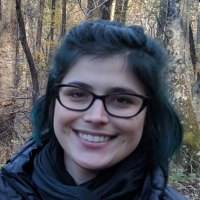

</img> 

 

Carsen Stringer is a group leader at HHMI Janelia Research Campus. The lab develops algorithms for understanding large-scale neural activity. In addition, the lab works on general segmentation algorithms for cellular data, which enable fast and accurate processing of ~50,000 neuron recordings.

<a href="cvs/stringer.pdf">CV</a> 
<a href="https://scholar.google.com/citations?user=6v9BmeYAAAAJ&hl=en"><i class="bi bi-google"></i> google scholar</a>  
<a href="https://github.com/carsen-stringer"><i class="bi bi-github"></i> carsen-stringer</a>  
<a href="https://bsky.app/profile/computingnature.bsky.social"><i class="bi bi-bluesky"></i> computingnature</a> 
