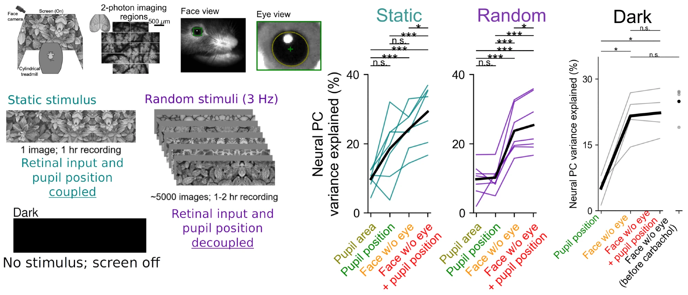
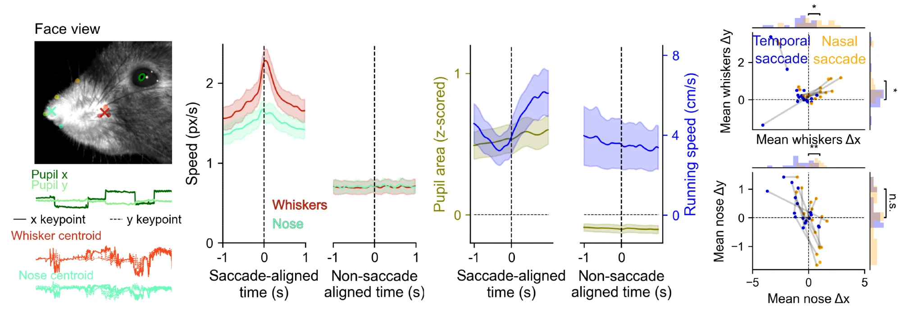

  

Abstract

  

Neural activity in mouse primary visual cortex (V1) correlates strongly with orofacial movements. Such strong modulation has not been found in the primate visual cortex during eye fixation (Talluri et al 2023), which led to the suggestion that the modulation may primarily depend on eye movements in both species (Kang et al 2025). Here we examined the influence of eye movements on neural activity in mouse visual cortex both in complete darkness and in the presence of different types of visual input. In all cases, we found that eye movements explain a smaller fraction of neural activity variance compared to orofacial behaviors. Additionally, we found that eye movements were correlated to orofacial movements, such as whisking and sniffing, and thus may be indirectly correlated to neural activity. These results further emphasize the impact of movement signals on mouse visual cortex during free viewing behavior.

<a href="https://www.biorxiv.org/content/10.64898/2026.02.04.703800.abstract">preprint</a>

[Thread](https://bsky.app/profile/atika-syeda.bsky.social/post/3me54ubbvms2e) by Atika Syeda:

Excited to share “Orofacial behaviors, not eye movements, govern neural activity in mouse visual cortex”

<video src='https://github.com/MouseLand/MouseLand.github.io/releases/download/v0.1/main_syeda_2.mp4' width="70%" loop="true" autoplay="autoplay" controls muted></video>

In our previous work we have shown orofacial movements drive neural activity in mouse visual cortex (Stringer et al, 2019; Syeda et al, 2024), but such strong modulation has not been found in the primate visual cortex (Talluri et al 2023).

This led to the suggestion that the modulation may primarily depend on eye movements in both species (Kang et al 2025). So we asked what is the relative contribution of eye vs. orofacial movements to visual cortical activity in mice? Is it different in the presence and absence of visual input?

Using our Facemap model we show that eye movements have modest contributions to visual cortical activity compared to orofacial behaviors. This difference in modulation remains unchanged in the presence or absence of visual input.

Spontaneous orofacial movements, such as whisking and sniffing, were also correlated to the time and direction of saccades in mice. This suggests orofacial behaviors play a key role in mouse visual processing which differs from primate vision highlighting species-level differences.

If you'd like to use our model to track orofacial behaviors in mice or to relate these behaviors with neural activity check out our GUI on Github: 

[https://github.com/MouseLand/facemap](https://github.com/MouseLand/facemap)

Thanks to collaborative effort of @nunezkant.bsky.social, 
@zhong-lin.bsky.social, @marius10p.bsky.social and @computingnature.bsky.social

 
